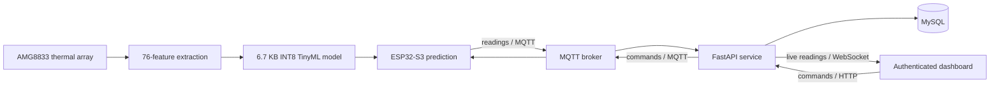
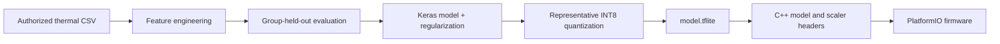

# Thermal Presence IoT System

An end-to-end TinyML occupancy monitor built around an ESP32-S3 and AMG8833
8x8 thermal array. The device engineers 76 features, runs a fully quantized
neural network locally, and sends live readings through MQTT to an authenticated
FastAPI dashboard.

- [Watch the TinyML hardware inference demo](https://youtu.be/LUHnM6G2Q4g)
- [Watch the connected dashboard demonstration](https://youtu.be/XclNvlHVHt8)

## Results

| Measure | Result |
| --- | ---: |
| Held-out group accuracy | 89.04% |
| Empty-room F1 | 88.97% |
| Person-present F1 | 89.12% |
| Held-out readings | 3,513 |
| Independent collection groups | 101 |
| INT8 TFLite model size | 6.7 KB |
| Model input | 76 engineered features |

Evaluation uses a held-out `GroupKFold` partition so readings from the same
collection participant cannot appear in both training and evaluation. After
evaluation, a fresh deployment model is trained on all authorized readings with
the exact `StandardScaler` exported to the ESP32. Full metrics are available in
[`ml/artifacts/metrics.json`](ml/artifacts/metrics.json).

## What it does

- Samples all 64 AMG8833 thermal pixels and the ambient thermistor.
- Computes ambient-normalized pixels, intensity statistics, spatial gradients,
  connected hot regions, quadrant variance, center/edge contrast, profile
  variation, hot-region position, and hot-pixel ratio.
- Standardizes the 76-feature vector with training-time scaler parameters.
- Runs a 32-16-1 neural network as INT8 TensorFlow Lite Micro inference.
- Supports one-shot and continuous acquisition through MQTT commands.
- Stores readings and discovered devices in MySQL.
- Streams readings to authenticated browsers over WebSockets.
- Renders an 8x8 temperature heatmap and recent database records.
- Runs the web application and database as Docker Compose services.

## System architecture



## ML pipeline



The training dataset is intentionally not published because it contains
collection identifiers belonging to other course participants. The repository
contains the complete loader contract, feature pipeline, grouped training code,
model artifacts, aggregate metrics, and synthetic tests without exposing those
records. See [`ml/README.md`](ml/README.md) for reproduction instructions using
an authorized dataset.

## My work

I implemented and integrated the project across its ML, embedded, and web layers:

- Thermal-frame normalization and 12 statistical/spatial summary features.
- Four-connected hot-region search and heat-location feature extraction.
- Group-isolated evaluation, feature scaling, neural-network training, and
  quantitative reporting.
- Representative-dataset calibration and full INT8 TFLite export.
- Python-to-C++ model/scaler header generation.
- ESP32 feature parity, quantization, inference, sensor acquisition, JSON
  serialization, MQTT commands, and continuous sampling.
- FastAPI authentication, command, reading, and device APIs.
- SQLAlchemy/MySQL persistence and MQTT-to-WebSocket live updates.
- Browser heatmap rendering and authenticated device controls.
- Automated TinyML artifact tests, API tests, and firmware CI builds.

This project began as a sequence of individual UC San Diego ECE 140 technical
assignments. The portfolio version combines the independently completed stages,
removes course instructions and participant data, fixes training/deployment
preprocessing inconsistencies, and adds reproducible tests and documentation.

## Technology

| Layer | Tools |
| --- | --- |
| TinyML | TensorFlow/Keras, scikit-learn, TFLite INT8, NumPy, pandas |
| Embedded | C++, PlatformIO, ESP32-S3, AMG8833, TensorFlow Lite Micro |
| Messaging | MQTT, PubSubClient |
| Backend | Python, FastAPI, Pydantic, SQLAlchemy |
| Data | MySQL 8, JSON thermal frames |
| Frontend | HTML, CSS, JavaScript, Canvas, WebSocket |
| Delivery | Docker Compose, GitHub Actions, pytest |

## Run the web system

Requirements: Docker and Docker Compose.

1. Copy `server/.env.example` to `server/.env`.
2. Replace `CHANGE_ME` and `YOUR_UNIQUE_TOPIC` with private values.
3. From `server`, run `docker compose up --build`.
4. Open `http://localhost:8000`, register an account, and sign in.

## Run the firmware

Requirements: an Adafruit Feather ESP32-S3, AMG8833, and PlatformIO.

1. Wire the sensor over I2C using the board's SDA, SCL, 3.3 V, and GND pins.
2. Copy `esp32/.env.example` to `esp32/.env`.
3. Configure Wi-Fi, MQTT broker, and the same MQTT topic used by the server.
4. Build and upload the `adafruit_feather_esp32s3` PlatformIO environment.

The committed firmware already contains the generated INT8 model and scaler
headers. `.env` files are ignored because they contain deployment credentials.

On Windows, build from a short local path if the legacy TensorFlow Lite Micro
dependency exceeds the toolchain's path-length limit.

## Test

```text
python -m pip install -r ml/requirements-dev.txt
python -m pytest ml/tests -q

cd server/webserver
python -m pip install -r requirements-dev.txt
python -m pytest -q
```

GitHub Actions runs the TinyML tests, API tests, and a complete ESP32 firmware
build with placeholder credentials.

## Security notes

- Passwords are hashed with bcrypt.
- Session cookies are HTTP-only and SameSite=Lax.
- Set `COOKIE_SECURE=true` when serving the dashboard over HTTPS.
- The public MQTT default is suitable for demonstrations only; use a private,
  authenticated broker for sensitive deployments.
