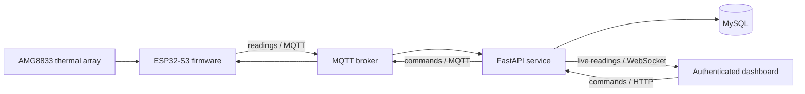

# Thermal Presence IoT System

An end-to-end occupancy monitor that turns an 8x8 thermal sensor into a live,
authenticated web dashboard. An ESP32-S3 collects AMG8833 measurements,
estimates whether a person is present, and exchanges readings and commands with
a FastAPI service over MQTT.

[Watch the hardware demonstration](https://youtu.be/XclNvlHVHt8)

## What it does

- Samples all 64 AMG8833 thermal pixels and the ambient thermistor.
- Detects presence from the peak-to-ambient temperature difference.
- Supports one-shot and continuous acquisition through MQTT commands.
- Stores readings and discovered devices in MySQL.
- Streams new readings to authenticated browsers over WebSockets.
- Renders a live 8x8 temperature heatmap and recent database records.
- Protects the dashboard and APIs with hashed passwords and server-side sessions.
- Runs the web application and database as Docker Compose services.

## System architecture



## My work

I implemented the project integration across the embedded and web layers:

- ESP32 sensor acquisition, JSON serialization, MQTT command handling, and
  continuous sampling control.
- Presence detection based on the temperature difference between the hottest
  pixel and the ambient thermistor.
- FastAPI routes for authentication, commands, readings, and device discovery.
- SQLAlchemy models and MySQL persistence for users, sessions, devices, and
  thermal measurements.
- MQTT-to-database ingestion and thread-safe WebSocket broadcasting.
- Browser heatmap rendering, session-aware controls, and recent-reading display.
- Automated API tests and CI checks for both the server and firmware build.

This project began as an individual UC San Diego ECE 140 technical assignment.
The portfolio version removes grading material and credentials, documents the
system as a standalone project, and adds reproducible testing and safer example
configuration.

## Technology

| Layer | Tools |
| --- | --- |
| Embedded | C++, PlatformIO, ESP32-S3, AMG8833, I2C |
| Messaging | MQTT, PubSubClient, EMQX public broker by default |
| Backend | Python, FastAPI, Pydantic, SQLAlchemy |
| Data | MySQL 8, JSON thermal frames |
| Frontend | HTML, CSS, JavaScript, Canvas, WebSocket |
| Delivery | Docker Compose, GitHub Actions, pytest |

## Run the web system

Requirements: Docker and Docker Compose.

1. Copy `server/.env.example` to `server/.env`.
2. Replace `CHANGE_ME` and `YOUR_UNIQUE_TOPIC` with private values.
3. From `server`, run `docker compose up --build`.
4. Open `http://localhost:8000`, register an account, and sign in.

The dashboard can be explored without the physical sensor after readings are
posted to the authenticated `/api/readings` endpoint.

## Run the firmware

Requirements: an Adafruit Feather ESP32-S3, AMG8833, and PlatformIO.

1. Wire the sensor over I2C using the board's SDA, SCL, 3.3 V, and GND pins.
2. Copy `esp32/.env.example` to `esp32/.env`.
3. Configure Wi-Fi and use the same MQTT topic as the server.
4. Build and upload the `adafruit_feather_esp32s3` PlatformIO environment.

The `.env` files are ignored because they contain passwords and deployment
settings. Only the `.env.example` templates belong in source control.

## Test

Server tests use SQLite and disable external MQTT connections, so they do not
require Docker, hardware, or internet access:

```text
cd server/webserver
python -m pip install -r requirements-dev.txt
python -m pytest -q
```

CI also compiles the ESP32 firmware with placeholder credentials to catch build
regressions.

## Current detection method

The firmware uses a transparent thermal-difference heuristic: it compares the
hottest pixel with the sensor's ambient thermistor reading, maps that difference
to a confidence score, and reports `PRESENT` at or above the configured 0.5
threshold. This repository does not claim on-device neural-network inference;
that would require a documented feature pipeline and hardware validation.

## Security notes

- Passwords are hashed with bcrypt.
- Session cookies are HTTP-only and SameSite=Lax.
- Set `COOKIE_SECURE=true` when serving the dashboard over HTTPS.
- The default public MQTT broker is suitable for demonstrations, not sensitive
  deployments. Use a private authenticated broker for production.
